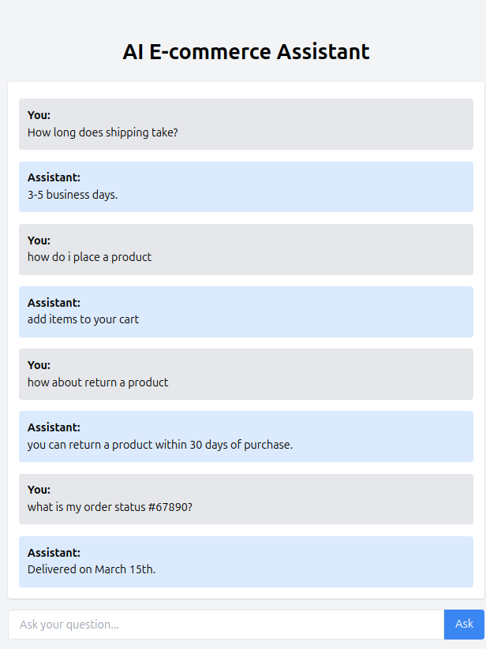

# AI E-commerce Assistant

## Description
This project is an AI-powered e-commerce assistant designed to help users with order tracking, FAQs, and general queries. It leverages machine learning models, APIs, and a React for frontend to deliver a seamless user experience.

## Features
- **Order Tracking**: Track orders by providing an order ID.
- **FAQ Retrieval**: Get answers to common questions such as shipping times and payment methods.
- **Intent Classification**: Automatically route queries to the appropriate agent using zero-shot classification.
- **Interactive Chat Interface**: Engage with a user-friendly, React-based chat interface.

## Installation

### Backend
1. Clone the repository:
   ```bash
   git clone <repository-url>
   cd <project-directory>
   ```

2. Install Python dependencies:
   ```bash
   pip install -r requirements.txt
   ```

3. Set up environment variables:
   - Create a `.env` file and add your Hugging Face API token:
     ```
     HUGGINGFACEHUB_API_TOKEN=your_token_here
     ```

4. Start the backend server:
   ```bash
   python app.py
   ```

### Frontend
1. Navigate to the frontend directory:
   ```bash
   cd frontend
   ```

2. Install dependencies:
   ```bash
   npm install
   ```

3. Start the frontend server:
   ```bash
   npm start
   ```

## Usage
1. Open the frontend in your browser at [http://localhost:3000](http://localhost:3000).
2. Interact with the assistant using queries such as:
   - "Where is my order #12345?"
   - "How do I place an order?"

## Project Structure
- **Frontend**: React-based UI for user interaction.
- **Backend**: FastAPI server for processing queries and routing them to agents.
- **Agents**:
  - `order_agent.py`: Manages order-related queries.
  - `faq_agent.py`: Provides answers to frequently asked questions.
  - `router_agent.py`: Handles query routing through intent classification.
- **Data**:
  - `orders.csv`: Mock data for order tracking.
  - `faq.csv`: Dataset for FAQ retrieval.

## Demo
